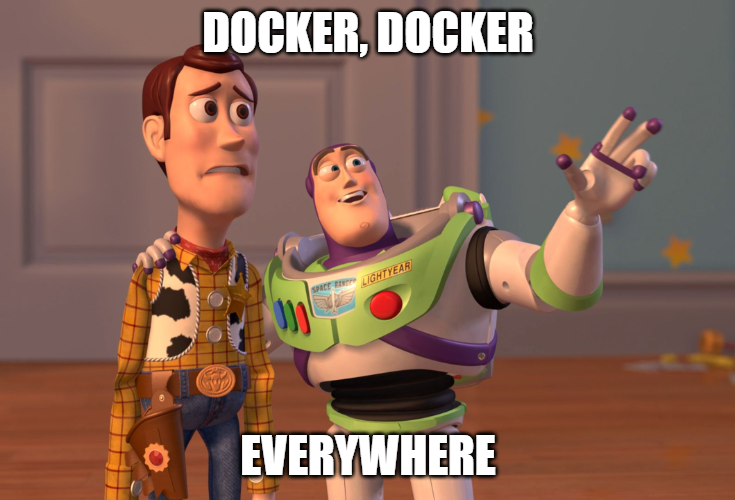

# Whalecome 🐳

    
    
    

A collection of Docker and docker-compose files, sometimes with additional files I use.

## Table of Contents

* [Docker Image Versions](#docker-image-versions)
* [Golang with Live-Reloading](go/README.md)
* [NestJS with development and Multi-Stage production using npm](nestjs-npm/README.md)
* [NestJS with development and Multi-Stage production using yarn](nestjs-yarn/README.md)

## Docker Image Versions

Usually the build section of every Docker Service includes an argument for pulling
as specific image version (e.g. NodeJS v18.12). If no argument is given, it defaults
to the ``latest`` tag.

This behaviour can be changed in the ``docker-compose.yml`` or the ``Dockerfile``
respectively.

    

